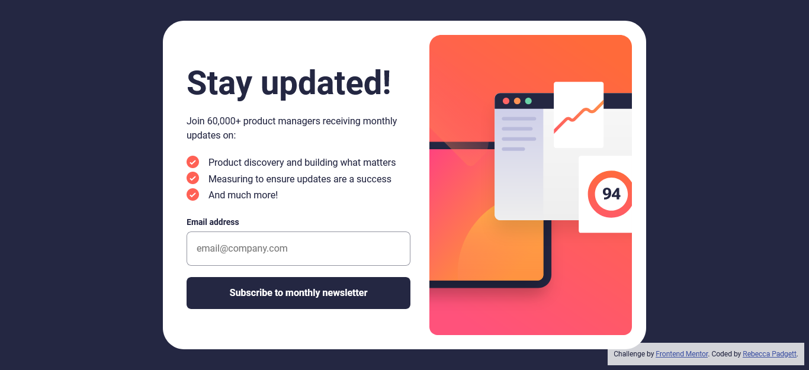

# Frontend Mentor - Newsletter sign-up form with success message solution

This is a solution to the [Newsletter sign-up form with success message challenge on Frontend Mentor](https://www.frontendmentor.io/challenges/newsletter-signup-form-with-success-message-3FC1AZbNrv). Frontend Mentor challenges help you improve your coding skills by building realistic projects.

## Table of contents

- [Overview](#overview)
  - [The challenge](#the-challenge)
  - [Screenshot](#screenshot)
  - [Links](#links)
- [My process](#my-process)
  - [Built with](#built-with)
  - [What I learned](#what-i-learned)
  - [Useful resources](#useful-resources)
- [Author](#author)
- [Acknowledgments](#acknowledgments)

## Overview

### The challenge

Users should be able to:

- Add their email and submit the form
- See a success message with their email after successfully submitting the form
- See form validation messages if:
  - The field is left empty
  - The email address is not formatted correctly
- View the optimal layout for the interface depending on their device's screen size
- See hover and focus states for all interactive elements on the page

### Screenshot



### Links

- Solution URL: [Frontend Mentor](https://your-solution-url.com)
- Live Site URL: [Github Pages](https://your-live-site-url.com)

## My process

### Built with

<p align="left">


</p>

### What I learned

In this project, reforced the implementation of the `<template></template>` tag again.

```html
<template data-js-template>
  <h1 class="visually-hidden">Newsletter Subscription Page</h1>
  <!-- Success message start -->
  
  <h2 class="newsletter__title">Thanks for subscribing!</h2>
  <p>
    A confirmation email has been sent to
    <strong>{{email}}</strong>
    Please open it and click the button inside to confirm your subscription.
  </p>
  <button class="button" data-js-reset>Dismiss message</button>
  <!-- Success message end -->
</template>
```

I created a function where you have data-reset attribute on the dismiss button and reloads the page. The second JavaScript snippet is setting the input to empty string.

```js
// return to the Newsletter form
function returnToForm(e) {
  if (e.target.hasAttribute("data-js-reset")) {
    location.reload();
  }
}

// set the input to empty string
document.getElementById("email").value = "";
```

### Useful resources

- [Interactive rating compoment](https://bccpadge.github.io/interactive-rating-component/) - I used the same approach with this project.
- [Template tag](hhttps://www.w3schools.com/TagS/tag_template.asp) - The `<template>` tag is great use case for a project like this because the HTML content is hidden when the page loads. The content within the `<template>` tag can be displayed by JavaScript.
- [Clear an Input](https://www.w3schools.com/howto/howto_html_clear_input.asp) - Removes the email and sets the input to an empty string

## Author

<p align="left">
<a href="https://www.frontendmentor.io/profile/bccpadge">

</a>
<a href="https://github.com/bccpadge">

 </a>
<a href="https://www.linkedin.com/in/rebecca-padgett23">

</a>

## Acknowledgments

[Newsletter Sign-up form solution reference](https://www.frontendmentor.io/solutions/newsletter-signup-form-with-success-message-ETZH8IkoEO)
